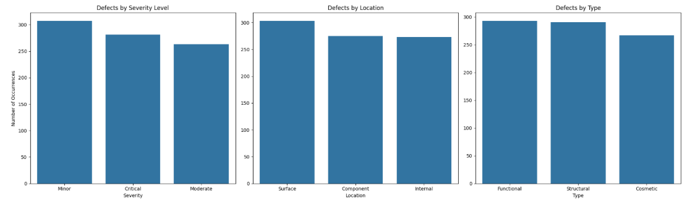
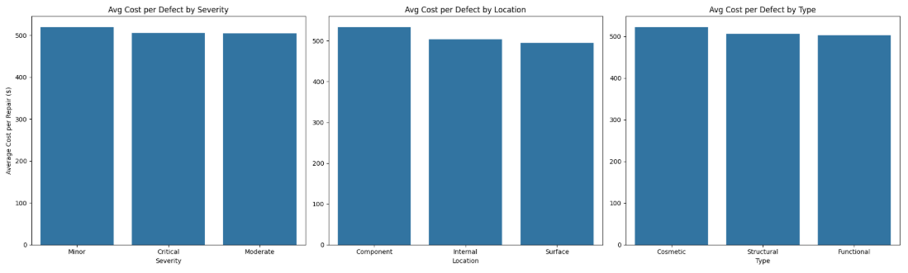
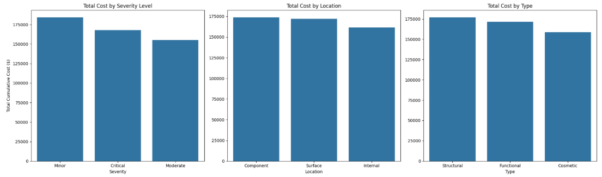
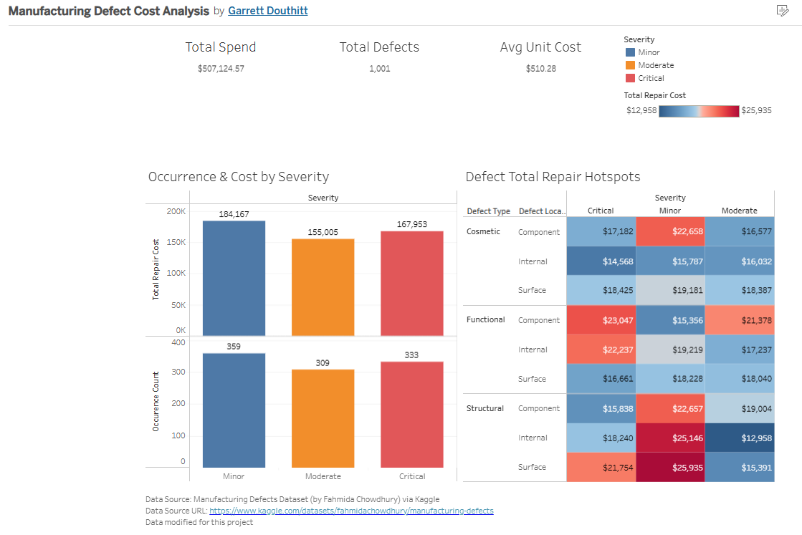

# Manufacturing Defect Analysis
For this project, a dataset from Kaggle.com (citation below) on manufacturing defects at a hypothetical company was taken for analysis. This data was pre-cleaned, so a few null values were manually inserted into the dataset to allow for data valiation and cleaning later in the process.

## The goals of this analysis project are to:
1. Identify Cost Drivers: Determine which severity level, defect type, or defect location is the most problematic for this company, and which would be the most effecient to focus on improving.
2. Provide data driven recommendations based on this data to assist leadership in prioritizing which aspects of the defects should be focused on to have the optimal impact on reducing loss due to defects.

## SQL Query
This dataset only had ~1000 entries, but I treated this project as if it were possible to have much larger datasets to work with. Because of this, I started with a SQL query (run in BigQuery) to consolodate all defects that had the same product ID, severity level, type, and location into a single group and track the occurances for each group, rather than working with each individual defect. Since there were 100 products in this dataset, this would limit any consolidated dataset to a maximium of 900 entries for further processing. This SQL query is below.

```sql
SELECT 
  product_id,
  defect_type,
  defect_location,
  severity,
  ROUND(AVG(repair_cost), 2) AS avg_repair_cost,
  COUNT(*) AS occurence_count,
  ROUND(SUM(repair_cost), 2) AS total_repair_cost
 
FROM 
  `sodium-task-488014-j1.defects.defects_edited` 

GROUP BY
product_id, defect_type, defect_location, severity

ORDER BY
product_id
```
Once the consolidated dataset was acquired, there were 851 different defect entries for this project. The data was then loaded into a Juypter notebook for further cleaning and analysis.

The full notebook is available in the notebooks folder of this repository, but the main take-aways will be recorded here. 

## Data Cleaning
Data cleaning identified two missing values within the dataset:
1. A null severity value was identifed and investigation concluded that the value could be updated to a "critical" severity.
2. A null repair cost value was idenfied as well. This missing value could not be determined, so approval was given by the project manager to assign the average cost of similar defects (all other defects that were functional, internal, critical defects).

## Exploratory Data Analysis
1. First, occurence was examined to see if any severity, type, or location of defect occurred significantly more frequently than others.
    - Minor defects were most frequent as expected, but interestingly, critical defects were just below minor, and above moderate.
    - defect occurence by location and type had some variance, but none stood out as a majority contributor. 


2. Next, both average cost per defect and total cost were examined to determine if any severity level, location or type had a larger impact on repair cost than others.
    - contrary to expectation, minor defects had a higher cost (both total and average) than either moderate or critical.
    - Again, no single type or location stood out as a major contributor.



## Dashboard

Finally a Tableau dashboard was created to display these findings.



## Conclusions

- Initial assumption would be that minor severity defects would be more frequent but cheaper to repair, while critical defects would be less frequent but more expensive to repair.
- After analysis, it shows that while minor defects are slightly more frequent than critical, they are actually more costly to repair, both cumulatively and per defect.
- Concerning defect type and location, no value stands out as either considerably more frequent or more costly.

## Recommendations
- Minor defects: first determine why minor defects are so costly to repair. This may be due to a standard operating procedure issue or a misunderstanding of how these defects aught to be repaired. It may be possible to bring cost or minor repairs down so that even if they are still frequent, they will not be as costly.
- Critical defects: determine why there is such a large occurence of critical defects. reinforced training or more robust SOPs may reduce the occurence of these critical defects.


## Dataset Source
- Manufacturing Defects Dataset (by Fahmida Chowdhury) via Kaggle
- Datasource URL: https://www.kaggle.com/datasets/fahmidachowdhury/manufacturing-defects
- Data modified for this project
